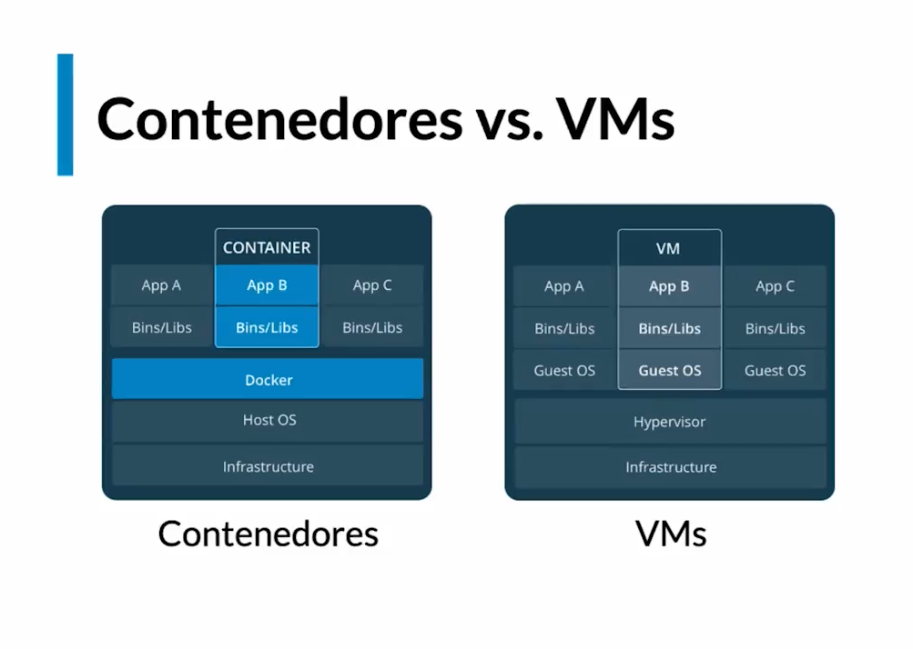

# Curso de Docker

## Las tres áreas en el desarrollo de software profesional

### Problemas cuando se construye Software:

- Entorno de desarrollo
- Dependencias
- Entorno de Ejecucion
- Equivalencia con entornos productivo
- Servicios externos

### Problemas en la Distribucion de Software:
El codigo debe transformarse en artefactos y deben poder ser transportados a donde seran ejecutados.
- Divergencia de repositorios
- Divergencia de artefactos
- Versionado

### Problems when executing:
La maquina deonde se escribe el software siempre es distinta a donde se ejecuta de manera productiva.
- Conpatibilidad con el entoprno productivo
- Dependencias
- Disponibilidad de servicios externos
- Recursos de hadware

Docker permite Construir, distribuir y ejecutar sofware en cualquier lado.

## Virtualización
Es la opcion que nos permite atacar los tres problemas en el desarrollo de software.
Pero las VM no son la mejor forma de hacerlo.
- Peso de la maquina
    - SO
- Costo de Administracion
    - Configuracion
    - Usuarios
    - paquetes de software
- Formatos
    - problemas en la distribucion
    - Compatibilidad con el entorno productivo


### Containerización
El empleo de contenedores para construir y desplegar software
- Ventajas
    - Flexibles
    - livianos
    - Portables: funcionan igual en cualquier maquina
    - Bajo Acoplamiento: son autocontenidos y no compiten entre ellos
    - Escalables: se pueden escalar y desescalar
    - Seguros: se aseguran de que se acceda a los recursos necesarios



## Preparando tu entorno de Trabajo

- [Download Docker](https://www.docker.com/get-started/)
- [Cent OS](https://docs.docker.com/engine/install/centos/)
- [Debian](https://docs.docker.com/engine/install/debian/)
- [Fedora](https://docs.docker.com/engine/install/fedora/)
- [Ubuntu](https://docs.docker.com/engine/install/ubuntu/)

[Docker Hub](https://hub.docker.com/)

#### Docker Desktop
 - Resources: configurar los recursos de la maquina


## Que es y como funciona Docker


### Componentes DENTRO del circulo de Docker:

- Docker daemon: Es el centro de docker, el corazón que gracias a el, podemos comunicarnos con los servicios de docker.
- REST API: Como cualquier otra API, es la que nos permite visualizar docker de forma “gráfica”.
- Cliente de docker: Gracias a este componente, podemos comunicarnos con el corazón de docker (Docker Daemon) que por defecto es la línea de comandos.
### Dentro de la arquitectura de Docker encontramos:

- Contenedores: Es la razón de ser de Docker, es donde podemos encapsular nuestras imagenes para llevarlas a otra computadora, o servidor, etc.
- Imagenes: Son las encapsulaciones de x contenedor. Podemos correr nuestra aplicación en Java por medio de una imagen, podemos utilizar Ubuntu para correr nuestro proyecto, etc.
- Volumenes de datos: Podemos acceder con seguridad al sistema de archivos de nuestra máquina.
- Redes: Son las que permiten la comunicación entre contenedores.


## Primeros Pasos - Hola Mundo
```
    docker run hello-world
```

## Conceptos fundamentales de Docker:
### contenedores
- Es una entidad Logica que corre de manera nativa en una máquina.
- Limitada que cosas puede ver o acceder, contando disco, memoria y cpu.

## Comprendiendo el estado de Docker

```
    # descargo (Si no lo tengo) y corro el contenedor
    docker run <contenedor>
    
    # Listado de contenedores
    docker ps
    docker ps -a
    
    # Detalles de un contenedor
    docker inspect <id>
    docker inspect <name>

    #Corriendo contenedor con nombre personalizado
    docker run --name <name> <contenedor>

    #Cambien el nombre del contenedor
    docker rename <id>|<name> <nuevo-nombre>

    #Eliminando un contenedor
    docker rm <id>|<name>

    #Eliminando todos los contenedores detenidos
    docker container prune
```